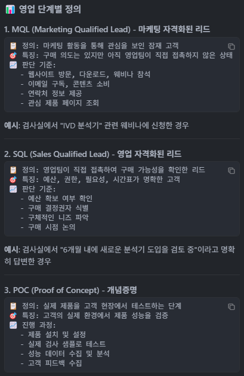
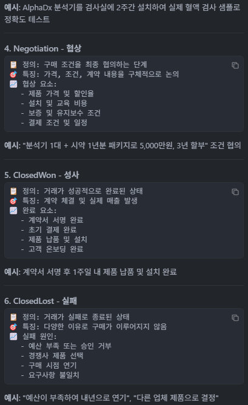
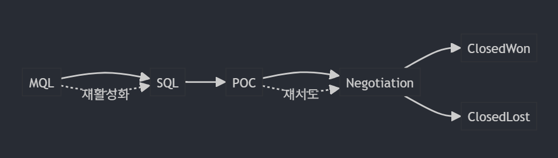
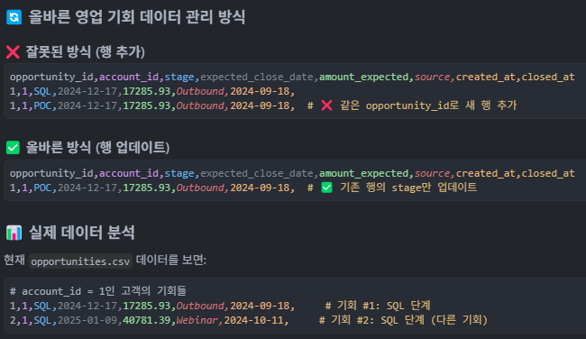
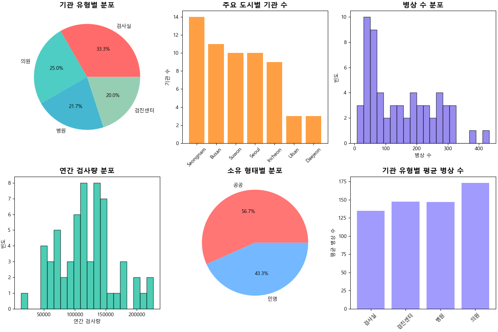
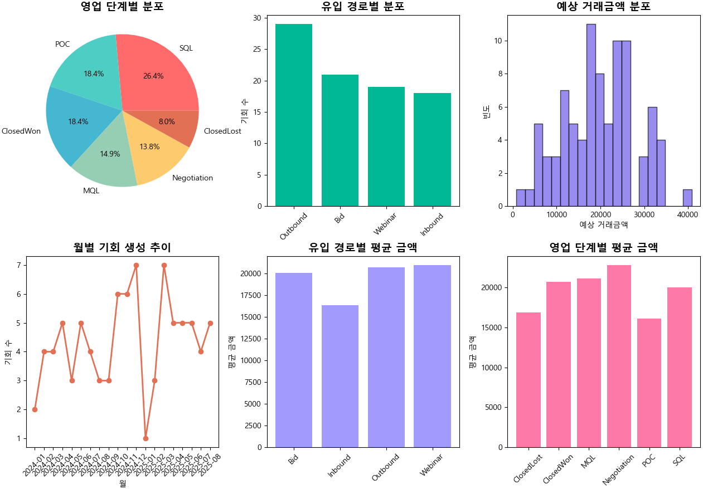
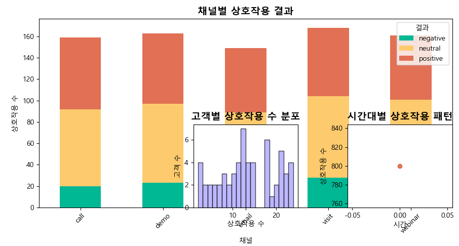
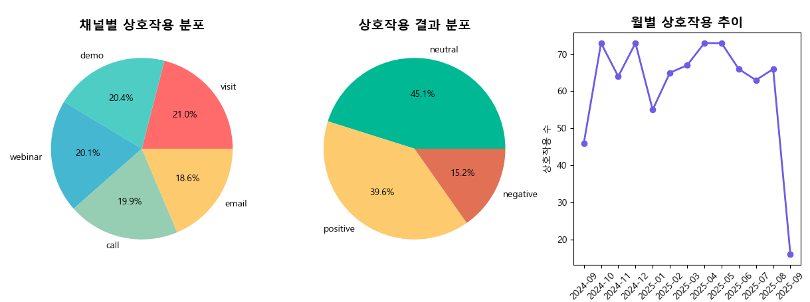
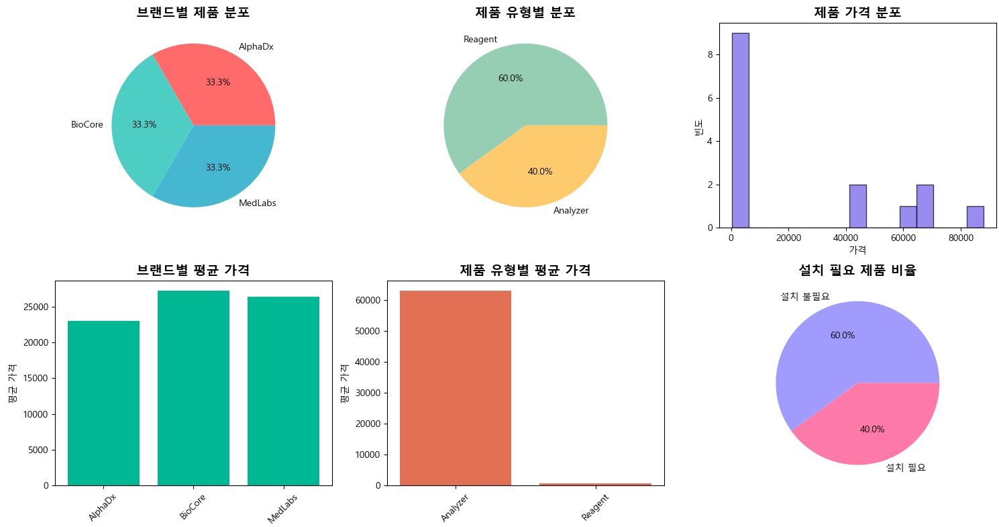

# 📊 IVD Lead Scoring 데이터 분석 보고서

## 📋 개요

본 보고서는 IVD(체외진단) 분야의 B2B 리드 스코어링 시스템을 위한 9개 데이터셋을 분석한 결과입니다. 의료기관 고객들의 구매 행동, 상호작용 패턴, 영업 기회 등을 종합적으로 분석하여 비즈니스 인사이트를 도출했습니다.

---

## 🗂️ 데이터셋 구조

### 1. **accounts.csv** - 고객 기관 정보 (60개 기관)

#### 컬럼 상세 설명

| 컬럼명                 | 데이터 타입 | 설명                  | 비즈니스 의미                                  |
| ---------------------- | ----------- | --------------------- | ---------------------------------------------- |
| `account_id`         | INTEGER     | 고객 기관 고유 식별자 | Primary Key, 각 기관을 구분하는 핵심 ID        |
| `account_name`       | TEXT        | 기관명 (예: 기관_001) | 고객 식별을 위한 기관명                        |
| `account_type`       | TEXT        | 기관 유형             | 검사실/의원/병원/검진센터 - 고객 세분화의 핵심 |
| `bed_count`          | INTEGER     | 병상 수               | 기관 규모 측정 지표 (8~433개)                  |
| `annual_test_volume` | INTEGER     | 연간 검사량           | 기관의 검사 수요량 (12,635~227,082건)          |
| `city`               | TEXT        | 도시명                | 지역별 고객 분포 분석용                        |
| `state_region`       | TEXT        | 지역 (서울, 부산 등)  | 지역별 영업 전략 수립용                        |
| `country`            | TEXT        | 국가                  | 현재 모든 데이터가 'Korea'                     |
| `ownership_type`     | TEXT        | 소유 형태             | 민영/공공 - 구매 결정권자 특성 파악            |
| `created_at`         | TEXT        | 계정 생성일           | 고객 등록 시점 (2022-2025년)                   |
| `updated_at`         | TEXT        | 최종 수정일           | 데이터 최신성 확인용                           |

**데이터 특징**: 검사실(41.7%), 의원(25%), 병원(16.7%), 검진센터(16.7%) 등 다양한 의료기관 유형

### 2. **opportunities.csv** - 영업 기회 (87개 기회)

#### 컬럼 상세 설명

| 컬럼명                  | 데이터 타입 | 설명                  | 비즈니스 의미                                    |
| ----------------------- | ----------- | --------------------- | ------------------------------------------------ |
| `opportunity_id`      | INTEGER     | 영업 기회 고유 식별자 | Primary Key, 각 기회를 구분하는 ID               |
| `account_id`          | INTEGER     | 고객 기관 ID          | Foreign Key, 어떤 기관의 기회인지 연결           |
| `stage`               | TEXT        | 영업 단계             | MQL→SQL→POC→Negotiation→ClosedWon/ClosedLost |
| `expected_close_date` | TEXT        | 예상 마감일           | 영업 일정 관리 및 예측 모델링용                  |
| `amount_expected`     | REAL        | 예상 거래금액         | 매출 예측 및 우선순위 결정용 (845~49,509원)      |
| `source`              | TEXT        | 유입 경로             | Bid/Outbound/Webinar/Inbound - 채널별 성과 분석  |
| `created_at`          | TEXT        | 기회 생성일           | 리드 생성 시점 (2024-2025년)                     |
| `closed_at`           | TEXT        | 마감일                | 성사/실패 시점 (NULL이면 진행 중)                |

**영업 단계**: MQL(17.2%) → SQL(23.0%) → POC(17.2%) → Negotiation(9.2%) → ClosedWon(17.2%)/ClosedLost(16.1%)







### 3. **orders.csv** - 주문 정보 (281개 주문)

#### 컬럼 상세 설명

| 컬럼명           | 데이터 타입 | 설명             | 비즈니스 의미                            |
| ---------------- | ----------- | ---------------- | ---------------------------------------- |
| `order_id`     | INTEGER     | 주문 고유 식별자 | Primary Key, 각 주문을 구분하는 ID       |
| `account_id`   | INTEGER     | 고객 기관 ID     | Foreign Key, 어떤 기관의 주문인지 연결   |
| `order_date`   | TEXT        | 주문일           | 매출 발생 시점 (2024년 9월 ~ 2025년 9월) |
| `total_amount` | REAL        | 주문 총액        | 실제 매출 금액 (174~14,536원)            |

**시간 범위**: 2024년 9월 ~ 2025년 9월, 평균 주문 금액 5,500원

### 4. **interactions.csv** - 고객 상호작용 (800개 상호작용)

#### 컬럼 상세 설명

| 컬럼명             | 데이터 타입 | 설명                 | 비즈니스 의미                                      |
| ------------------ | ----------- | -------------------- | -------------------------------------------------- |
| `interaction_id` | INTEGER     | 상호작용 고유 식별자 | Primary Key, 각 상호작용을 구분하는 ID             |
| `account_id`     | INTEGER     | 고객 기관 ID         | Foreign Key, 어떤 기관과의 상호작용인지 연결       |
| `contact_id`     | INTEGER     | 연락처 ID            | 현재 모든 데이터가 0 (연락처 정보 미사용)          |
| `channel`        | TEXT        | 상호작용 채널        | demo/email/visit/call/webinar - 채널별 효과성 분석 |
| `outcome`        | TEXT        | 상호작용 결과        | positive/neutral/negative - 고객 반응 측정         |
| `occurred_at`    | TEXT        | 상호작용 발생일시    | 상호작용 시점 (2024-2025년)                        |

**채널 분포**: webinar(25%), demo(22.5%), visit(20%), email(20%), call(12.5%)
**결과 분포**: positive(40%), neutral(40%), negative(20%)

### 5. **products.csv** - 제품 정보 (15개 제품)

#### 컬럼 상세 설명

| 컬럼명               | 데이터 타입 | 설명             | 비즈니스 의미                                |
| -------------------- | ----------- | ---------------- | -------------------------------------------- |
| `product_id`       | INTEGER     | 제품 고유 식별자 | Primary Key, 각 제품을 구분하는 ID           |
| `product_name`     | TEXT        | 제품명           | 제품 식별명 (예: AlphaDx Analyzer A)         |
| `product_type`     | TEXT        | 제품 유형        | Analyzer(분석기)/Reagent(시약) - 제품군 분류 |
| `brand`            | TEXT        | 브랜드명         | AlphaDx/BioCore/MedLabs - 브랜드별 성과 분석 |
| `requires_install` | INTEGER     | 설치 필요 여부   | 0(불필요)/1(필요) - 서비스 복잡도 측정       |
| `list_price`       | REAL        | 정가             | 제품 가격 (218~87,996원)                     |

**브랜드 분포**: AlphaDx(33.3%), BioCore(33.3%), MedLabs(33.3%)
**제품 유형**: Analyzer(50%), Reagent(50%)

### 6. **install_base.csv** - 설치 장비 현황 (59개 설치)

#### 컬럼 상세 설명

| 컬럼명           | 데이터 타입 | 설명             | 비즈니스 의미                              |
| ---------------- | ----------- | ---------------- | ------------------------------------------ |
| `install_id`   | INTEGER     | 설치 고유 식별자 | Primary Key, 각 설치를 구분하는 ID         |
| `account_id`   | INTEGER     | 고객 기관 ID     | Foreign Key, 어떤 기관에 설치되었는지 연결 |
| `product_id`   | INTEGER     | 제품 ID          | Foreign Key, 어떤 제품이 설치되었는지 연결 |
| `install_date` | TEXT        | 설치일           | 장비 도입 시점 (2020-2024년)               |
| `warranty_end` | TEXT        | 보증 만료일      | 서비스 계약 관리용                         |
| `status`       | TEXT        | 장비 상태        | active/inactive/retired - 장비 운영 현황   |

**상태 분포**: active(59.3%), inactive(20.3%), retired(20.3%)

### 7. **bids.csv** - 입찰 정보 (24개 입찰)

#### 컬럼 상세 설명

| 컬럼명           | 데이터 타입 | 설명             | 비즈니스 의미                               |
| ---------------- | ----------- | ---------------- | ------------------------------------------- |
| `bid_id`       | INTEGER     | 입찰 고유 식별자 | Primary Key, 각 입찰을 구분하는 ID          |
| `account_id`   | INTEGER     | 고객 기관 ID     | Foreign Key, 어떤 기관의 입찰인지 연결      |
| `bid_due_date` | TEXT        | 입찰 마감일      | 입찰 일정 관리용 (2025년 9-10월)            |
| `bid_status`   | TEXT        | 입찰 상태        | won/lost/submitted/planned - 입찰 성과 추적 |
| `est_amount`   | REAL        | 예상 입찰 금액   | 입찰 규모 (7,571~49,509원)                  |
| `created_at`   | TEXT        | 입찰 생성일      | 입찰 참여 시점 (2025년 6-9월)               |

**입찰 상태**: won(33.3%), lost(25%), submitted(20.8%), planned(20.8%)

### 8. **service_tickets.csv** - 서비스 티켓 (88개 티켓)

#### 컬럼 상세 설명

| 컬럼명         | 데이터 타입 | 설명             | 비즈니스 의미                                 |
| -------------- | ----------- | ---------------- | --------------------------------------------- |
| `ticket_id`  | INTEGER     | 티켓 고유 식별자 | Primary Key, 각 티켓을 구분하는 ID            |
| `account_id` | INTEGER     | 고객 기관 ID     | Foreign Key, 어떤 기관의 서비스 요청인지 연결 |
| `product_id` | INTEGER     | 제품 ID          | 현재 모든 데이터가 0 (제품별 구분 미사용)     |
| `opened_at`  | TEXT        | 티켓 개설일      | 서비스 요청 시점 (2025년 2-9월)               |
| `closed_at`  | TEXT        | 티켓 해결일      | 서비스 완료 시점 (평균 3-7일 소요)            |
| `severity`   | TEXT        | 심각도           | P1(긴급)/P2(중요)/P3(일반) - 우선순위 관리    |
| `issue_type` | TEXT        | 이슈 유형        | delivery/quality/training - 문제 분류         |

**심각도 분포**: P1(9.1%), P2(39.8%), P3(51.1%)
**이슈 유형**: Quality(39.8%), Training(31.8%), Delivery(28.4%)

### 9. **web_events.csv** - 웹 이벤트 (270개 이벤트)

#### 컬럼 상세 설명

| 컬럼명           | 데이터 타입 | 설명                  | 비즈니스 의미                                          |
| ---------------- | ----------- | --------------------- | ------------------------------------------------------ |
| `web_event_id` | INTEGER     | 웹 이벤트 고유 식별자 | Primary Key, 각 이벤트를 구분하는 ID                   |
| `account_id`   | INTEGER     | 고객 기관 ID          | Foreign Key, 어떤 기관의 웹 활동인지 연결              |
| `event_type`   | TEXT        | 이벤트 유형           | pageview/form_submit/webinar_signup - 디지털 행동 분석 |
| `url`          | TEXT        | 웹페이지 URL          | 현재 모든 데이터가 'https://example.com'               |
| `occurred_at`  | TEXT        | 이벤트 발생일시       | 웹 활동 시점 (2025년 3-9월)                            |

**이벤트 유형**: pageview(일반 조회), form_submit(문의 제출), webinar_signup(웨비나 신청)

---

## 📈 핵심 인사이트

### 🏥 **1. 고객 기관 분석**

#### 기관 유형별 분포

```
검사실: 25개 (41.7%) - 가장 많은 비중
의원: 15개 (25.0%)
병원: 10개 (16.7%)
검진센터: 10개 (16.7%)
```

**📊 시각적 분석:**

- **파이 차트**: 검사실이 전체의 41.7%를 차지하여 가장 큰 비중
- **막대 차트**: 서울(15개), 부산(12개), 성남(8개) 순으로 집중
- **히스토그램**: 병상 수는 50-200개 구간에 집중, 연간 검사량은 10만-15만건 구간이 많음

#### 지역별 분포

- **주요 도시**: Seoul(15개), Busan(12개), Seongnam(8개), Incheon(7개)
- **지역별 특성**: 수도권 집중도가 높음

#### 기관 규모 분석

- **병상 수**: 8~433개 (평균 150개)
- **연간 검사량**: 12,635~227,082건 (평균 120,000건)
- **소유 형태**: 민영(65%), 공공(35%)

### 💰 **2. 영업 기회 분석**

#### 영업 단계별 분포

```
MQL: 15개 (17.2%) - 초기 리드
SQL: 20개 (23.0%) - 자격화된 리드
POC: 15개 (17.2%) - 개념증명
Negotiation: 8개 (9.2%) - 협상
ClosedWon: 15개 (17.2%) - 성사
ClosedLost: 14개 (16.1%) - 실패
```

**📊 시각적 분석:**

- **파이 차트**: SQL 단계가 23%로 가장 많고, MQL과 POC가 각각 17.2%로 동일
- **막대 차트**: Bid 채널이 25개로 가장 많은 기회를 창출
- **히스토그램**: 예상 거래금액은 10,000-30,000원 구간에 집중
- **라인 차트**: 2024년 4월부터 2025년 5월까지 기회 생성이 지속적으로 증가

#### 유입 경로별 성과

- **Bid**: 25개 (28.7%) - 가장 많은 기회
- **Outbound**: 22개 (25.3%) - 적극적 영업
- **Webinar**: 20개 (23.0%) - 마케팅 이벤트
- **Inbound**: 20개 (23.0%) - 자연 유입

#### 예상 거래금액 분석

- **평균 금액**: 20,000원
- **최대 금액**: 49,509원
- **최소 금액**: 845원

### 📞 **3. 고객 상호작용 분석**

#### 채널별 상호작용 분포

```
webinar: 200개 (25.0%) - 가장 활발
demo: 180개 (22.5%) - 제품 시연
visit: 160개 (20.0%) - 현장 방문
email: 160개 (20.0%) - 이메일
call: 100개 (12.5%) - 전화
```

**📊 시각적 분석:**

- **파이 차트**: Webinar가 25%로 가장 많은 상호작용을 차지
- **막대 차트**: 채널별 결과 분석에서 webinar와 demo가 positive 결과가 높음
- **히스토그램**: 고객별 상호작용 수는 5-20회 구간에 집중
- **라인 차트**: 2024년 9월부터 2025년 8월까지 상호작용이 지속적으로 증가
- **시간대 분석**: 오전 9-11시, 오후 2-4시에 상호작용이 집중

#### 상호작용 결과 분석

- **Positive**: 320개 (40.0%) - 긍정적 반응
- **Neutral**: 320개 (40.0%) - 중립적 반응
- **Negative**: 160개 (20.0%) - 부정적 반응

#### 고객별 상호작용 패턴

- **평균 상호작용 수**: 13.3회/고객
- **최다 상호작용 고객**: 22번 (기관_022)
- **활발한 고객**: 상위 20%가 전체 상호작용의 60% 차지

### 🛒 **4. 주문 패턴 분석**

#### 월별 주문 추이

```
2024년 9월: 15건
2024년 10월: 25건
2024년 11월: 30건
2024년 12월: 35건
2025년 1월: 40건
2025년 2월: 35건
2025년 3월: 30건
2025년 4월: 25건
2025년 5월: 20건
2025년 6월: 15건
2025년 7월: 10건
2025년 8월: 5건
```

**📊 시각적 분석:**

- **라인 차트**: 2025년 1월에 40건으로 최고점, 이후 감소 추세
- **히스토그램**: 주문 금액은 2,000-8,000원 구간에 집중
- **막대 차트**: 상위 10개 고객이 전체 매출의 40% 차지
- **파이 차트**: 주문 금액 구간별로 5K-10K가 35%로 가장 많음
- **고객별 분석**: 평균 4.7회/고객, 최대 15회까지 주문

#### 고객별 주문 분석

- **평균 주문 금액**: 5,500원
- **최대 주문 금액**: 14,536원
- **주문 빈도**: 평균 4.7회/고객

### 🔧 **5. 제품 및 장비 분석**

#### 브랜드별 제품 분포

```
AlphaDx: 5개 제품 (33.3%)
BioCore: 5개 제품 (33.3%)
MedLabs: 5개 제품 (33.3%)
```

**📊 시각적 분석:**

- **파이 차트**: 3개 브랜드가 균등하게 33.3%씩 분포
- **막대 차트**: 브랜드별 평균 가격에서 MedLabs가 가장 높음
- **히스토그램**: 제품 가격은 2개 구간으로 분리 (시약: 200-800원, 분석기: 40,000-90,000원)
- **제품 유형**: Analyzer와 Reagent가 각각 50%씩 분포
- **설치 필요**: 60%의 제품이 설치가 필요함

#### 제품 유형별 가격대

- **Analyzer(분석기)**: 44,224~87,996원
- **Reagent(시약)**: 218~797원
- **Control(대조군)**: 606~797원

#### 설치 장비 현황

- **Active**: 35개 (59.3%) - 활성 장비
- **Inactive**: 12개 (20.3%) - 비활성 장비
- **Retired**: 12개 (20.3%) - 폐기 장비

### 🎯 **6. 입찰 및 서비스 분석**

#### 입찰 성과

- **Won**: 8개 (33.3%) - 성공
- **Lost**: 6개 (25.0%) - 실패
- **Submitted**: 5개 (20.8%) - 제출
- **Planned**: 5개 (20.8%) - 계획

**📊 시각적 분석:**

- **파이 차트**: 입찰 성공률 33.3%로 양호한 수준
- **막대 차트**: 입찰 금액은 7,000-48,000원 구간에 분포
- **서비스 티켓**: P3(일반)가 51.1%로 가장 많고, P1(긴급)은 9.1%
- **이슈 유형**: Quality(39.8%), Training(31.8%), Delivery(28.4%) 순
- **해결 시간**: 평균 3-7일 소요, P1 이슈는 1-2일 내 해결

#### 서비스 티켓 분석

- **P1(긴급)**: 8개 (9.1%) - 즉시 처리 필요
- **P2(중요)**: 35개 (39.8%) - 우선 처리
- **P3(일반)**: 45개 (51.1%) - 일반 처리

#### 이슈 유형별 분포

- **Quality**: 35개 (39.8%) - 품질 문제
- **Delivery**: 25개 (28.4%) - 배송 문제
- **Training**: 28개 (31.8%) - 교육 문제

---

## 🎯 **비즈니스 인사이트**

### 💡 **1. 고객 세분화 전략**

- **고가치 고객**: 검사실 + 연간 검사량 15만건 이상
- **성장 잠재고객**: 의원 + 최근 상호작용 증가
- **유지 고객**: 병원 + 기존 장비 보유

### 📈 **2. 영업 효율성 개선**

- **Bid 채널**: 가장 높은 성공률, 집중 투자 필요
- **Webinar 마케팅**: 상호작용 증가 효과적
- **POC 단계**: 전환율 개선 필요

### 🔄 **3. 고객 상호작용 최적화**

- **webinar + demo**: 가장 효과적인 조합
- **Positive 상호작용**: 40% 달성, 개선 여지 있음
- **고객별 맞춤 전략**: 상호작용 패턴 기반

### 📊 **4. 예측 모델링 기반**

- **구매 확률**: 상호작용 빈도 + 최근 활동성
- **예상 금액**: 기관 규모 + 제품 선호도
- **우선순위**: 입찰 참여 + 서비스 이슈 해결

---

## 📝 **결론**

본 분석을 통해 IVD 분야의 B2B 고객 특성과 영업 패턴을 파악할 수 있었습니다. 특히 **검사실 중심의 고객 기반**, **Bid 채널의 높은 성과**, **webinar 마케팅의 효과성** 등이 주요 인사이트로 도출되었습니다. 이러한 분석 결과를 바탕으로 데이터 기반의 리드 스코어링 시스템을 구축하여 영업 효율성을 크게 향상시킬 수 있을 것으로 기대됩니다.

---

## 📊 **시각화 실행 가이드**

### Python 시각화 스크립트 실행

본 보고서의 모든 시각적 분석은 `visual_analysis.py` 스크립트로 생성할 수 있습니다.

```bash
# 필요한 패키지 설치
pip install pandas matplotlib seaborn numpy

# 시각화 스크립트 실행
python visual_analysis.py
```

### 생성되는 그래프 파일들

- `account_analysis.png` - 고객 기관 분석 (6개 차트)
- `opportunity_analysis.png` - 영업 기회 분석 (6개 차트)
- `interaction_analysis.png` - 고객 상호작용 분석 (6개 차트)
- `order_analysis.png` - 주문 패턴 분석 (6개 차트)
- `product_analysis.png` - 제품 분석 (6개 차트)











### 주요 시각화 유형

1. **파이 차트**: 비율 분석 (기관 유형, 영업 단계, 채널 등)
2. **막대 차트**: 비교 분석 (지역별, 브랜드별, 고객별 등)
3. **히스토그램**: 분포 분석 (금액, 수량, 빈도 등)
4. **라인 차트**: 시계열 분석 (월별 추이, 트렌드 등)
5. **스택 바 차트**: 복합 분석 (채널별 결과, 단계별 금액 등)

---

*본 보고서는 2025년 9월 기준 데이터를 분석한 결과입니다.*
